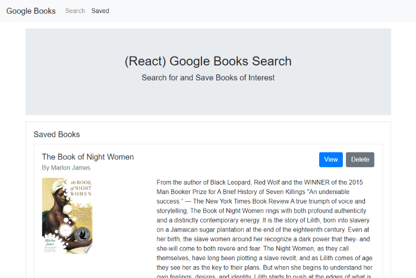

# Google Books Search MERN App
<https://google-books-react-project.herokuapp.com/> \
Version 1.0 \
Original Deployment Date - Aug 27, 2020\
By Jarrett Dougherty

<kbd></kbd>

## Description
Google Books Search is a full-stack MERN application that allows users to search for and save books. The search feature utlizes the Google Books API. The application is built with React.js, Node.js, Express.js, and MongoDB.

## Technologies Used
* React.js
* Node.js
* Express.js
* MongoDB
* Mongoose
* Axios
* Bootstrap
* JavaScript
* HTML
* CSS

## Instructions For Use
### Getting Started 
1. Simply click the link to start the web app.

<https://google-books-react-project.herokuapp.com/>

2. Input a book title or author in the Book Search bar and click `Search` to get the top five results for the query.

3. Click the `View` button to see the Google Books entry for the title. Click `Save` to add to the Saved list.

4. Navigate to the `Saved` tab to see other titles that users have previously saved.

5. Books can be removed from the Saved list with the `Delete` button.

### GitHub Code
1. Once you have downloaded the program you will need to run the following command to install the required node packages.

```console
$ npm install
```
2. You will need to have [MongoDB](https://www.mongodb.com/try/download/community) installed on your computer to run the application locally. 

3. Next, create a file named `.env` at the root level, add the following to it, replacing the value ****** with your Google Books API Key. (An API key from [Google Books](https://developers.google.com/books/docs/v1/getting_started) is required to run the application locally.)

```console
# mySQL password

apiKey=******
```

4. Run the following code to start the app in your local environment.

```console
$ npm start
```

5. Open `http://localhost:3000` in your browser to view the app.